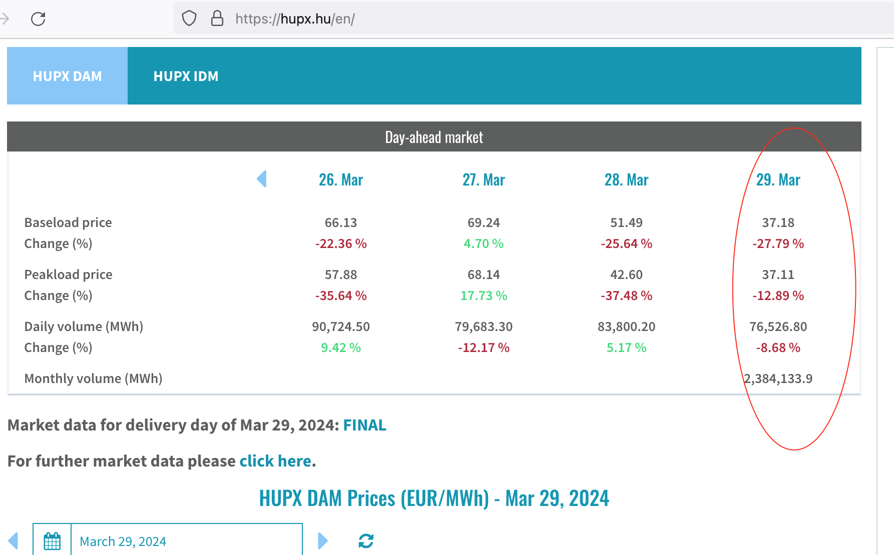

# HUPX Hungarian Power exchange dayli data
Get data from HUPX 


To install this package
```
go get github.com/mishop/hupxapi 
```

## How to use?
```
import (
	"github.com/mishop/hupxapi"
)
```

Retresive data
```
hupxapi.GetHUPX("2006-01-02")
```

## Full example daily data
```
package main

import (
	"fmt"
	"time"

	"github.com/mishop/hupxapi"
)

func main() {
	// download the target HTML document
	currentTime := time.Now()
	data := hupxapi.GetHUPX(currentTime.Format("2006-01-02"))
	fmt.Println("Baseload price", data["Baseload price"])
}
```